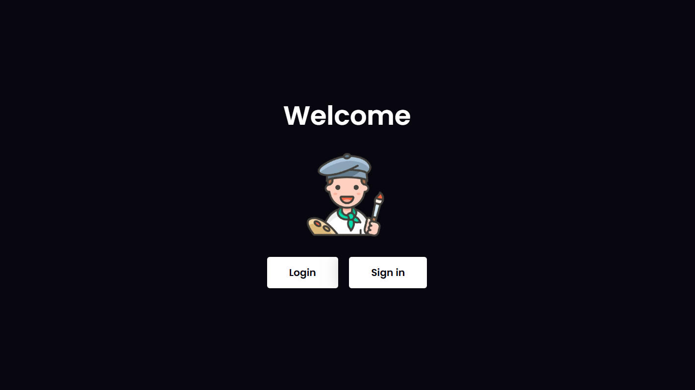
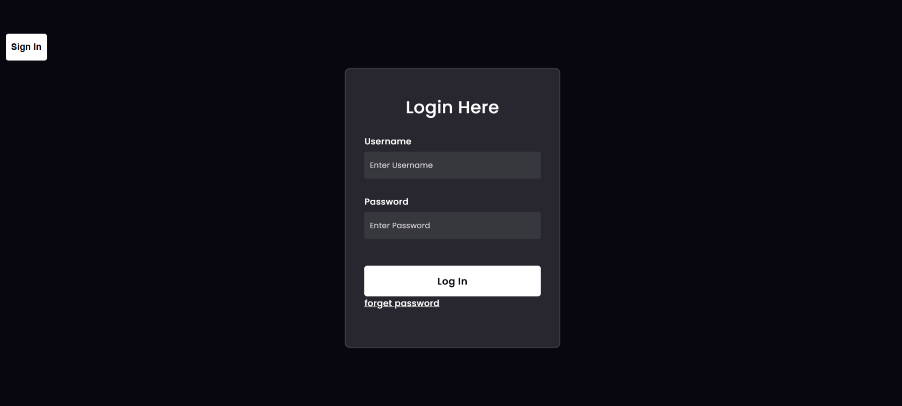
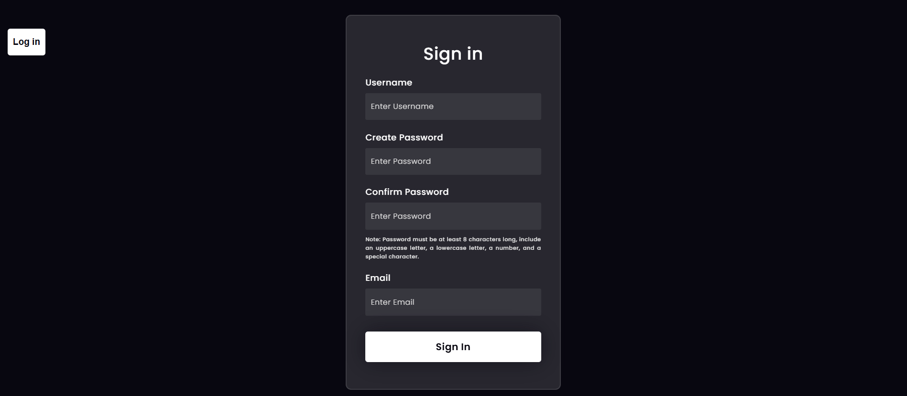
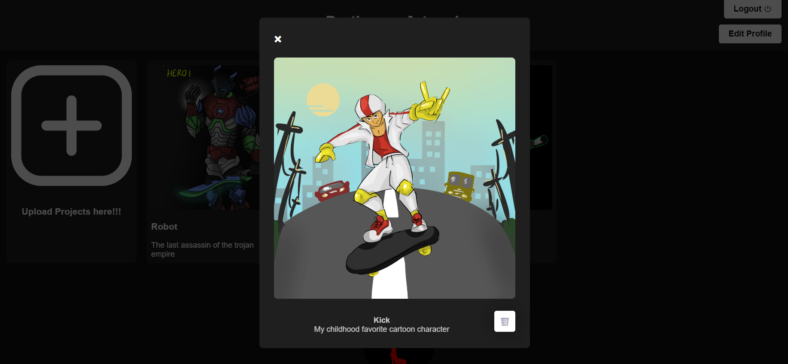
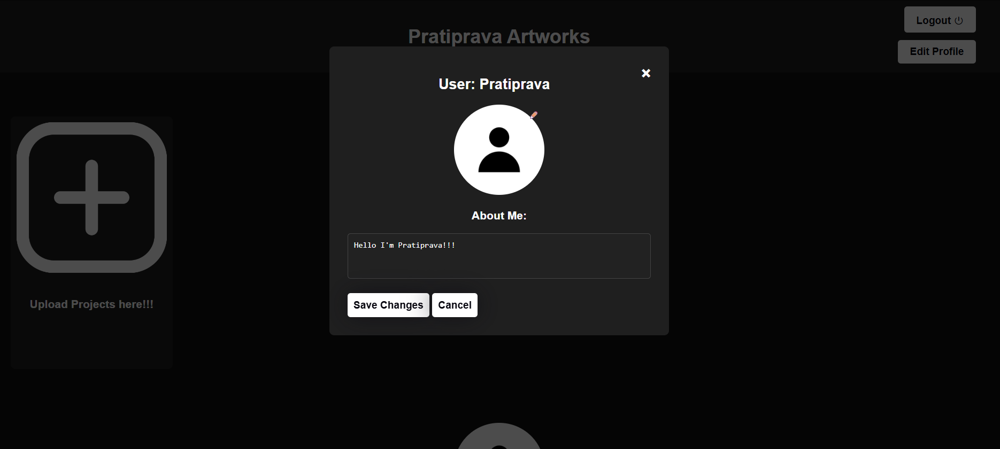
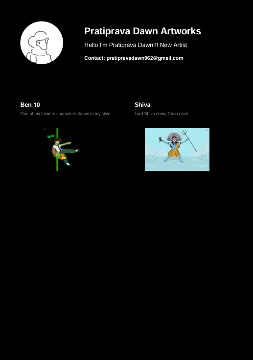
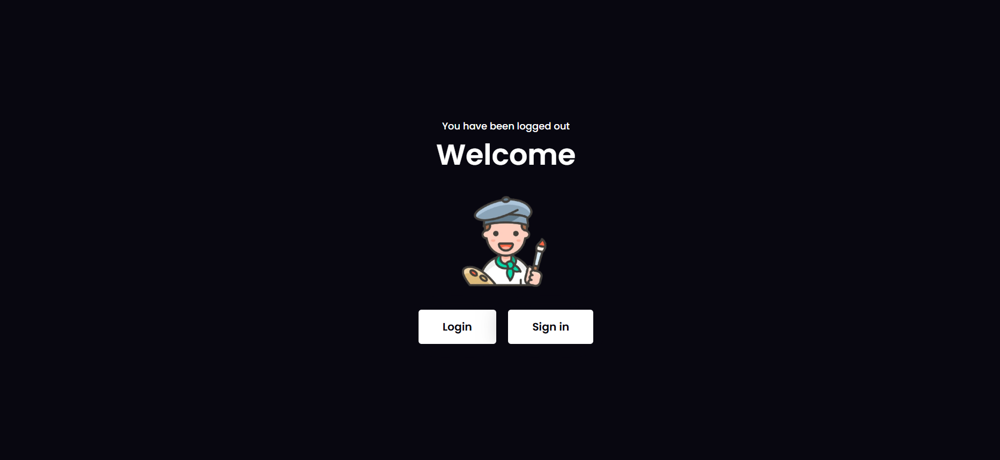

# 🎨 Personalised Portfolio

**Personalised Portfolio** is a web-based application designed for artists to create, manage, and showcase their digital portfolios in a secure and user-friendly environment. It allows users to store and organize their artwork with the ability to personalize their profiles.

---

## 🔧 Features

* 🔐 **Secure Authentication**
  Login and logout functionality with encrypted credential handling.

* 🔁 **Forgot Password**
  Password reset feature for account recovery.

* 🔒 **Strong Password Enforcement**
  Ensures passwords meet strength requirements for added security.

* 🖼️ **Artwork Management**
  Upload, view, and delete images of your artwork.

* 🧹 **Delete Photo**
  Easily remove any previously uploaded photos from your portfolio.

* 👤 **Profile Customization**
  Edit profile picture and 'About' section to personalize your portfolio.

* 🎨 **Theme Change (Light/Dark Mode)**
  Toggle between light and dark themes for a personalized viewing experience.

* 📄 **PDF Download**
  Export your portfolio as a PDF to share or store offline.

---

## 🛠️ Tech Stack

| Layer        | Technology                           |
| ------------ | ------------------------------------ |
| **Backend**  | Python, Flask                        |
| **Frontend** | HTML, CSS, JavaScript                |
| **Database** | SQLAlchemy (SQLite/PostgreSQL/MySQL) |

---

## 🗂️ Project Structure

**personalised-portfolio/**

* static/         # Uploaded images & CSS/JS files
* templates/      # HTML templates (Jinja2)
* main.py         # Main Flask app
* models.py       # SQLAlchemy models
* utils.py        # Helper functions
* report.py       # PDF generation script
* requirements.txt # Project dependencies
* README.md       # This file

---

### Installation

1. **Clone the repository:**

   ```bash
   git clone https://github.com/yourusername/personalised-portfolio.git
   cd personalised-portfolio
   ```
2. **Install dependencies:**

   ```bash
   pip install -r requirements.txt
   ```
3. **Run the Application:**

   ```bash
   python main.py
   ```

---

## 🚀 Usage

* 🔐 **Sign up and log in securely**
  Create an account or access your portfolio using a strong password system.

* 🖼️ **Upload and display your art**
  Add images to your portfolio with titles and descriptions.

* 🗂️ **View all saved images**
  Browse your personal gallery and see your uploaded artworks.

* ✏️ **Edit your profile picture and 'About' section**
  Customize your profile to reflect your artistic identity.

* 🗑️ **Delete photos anytime from the gallery**
  Remove any image permanently from your portfolio.

* 🎨 **Switch themes with one click**
  Enjoy a light or dark experience depending on your preference.

* 📄 **Download your portfolio as PDF**
  Generate a clean offline copy of your portfolio to share with clients or keep for records.

* 🚪 **Logout to end session**
  Safely exit the application and clear your session.

---

## 📸 Screenshots
 
 
 
 
 
 
 
 

